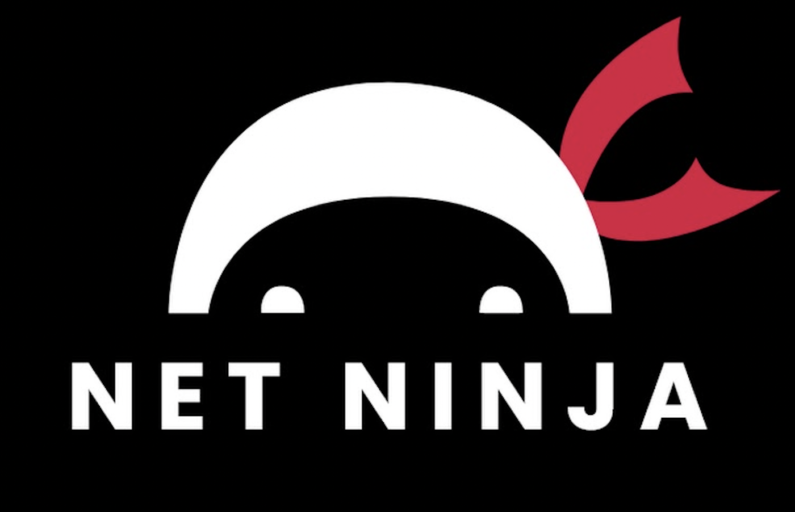

#  Ninja List

This is a [Next.js](https://nextjs.org/) project bootstrapped with [`create-next-app`](https://github.com/vercel/next.js/tree/canary/packages/create-next-app) following the [Next.js tutorial](https://www.youtube.com/playlist?list=PL4cUxeGkcC9g9gP2onazU5-2M-AzA8eBw) from Net Ninja.

## Getting Started

Make sure you have npm and node installed on your local.
Fork and clone this repository:
```bash
git clone git@github.com:irahrosete/ninjalist.git
```

Install all dependencies:
```bash
npm install
# or
yarn install
```

Then run the development server:
```bash
npm run dev
# or
yarn dev
```

Open [http://localhost:3000](http://localhost:3000) with your browser to see the app.

## Deployment

This app is deployed on the [Vercel Platform](https://vercel.com/new?utm_medium=default-template&filter=next.js&utm_source=create-next-app&utm_campaign=create-next-app-readme).

You can check it out here: https://ninjalist-woad.vercel.app/